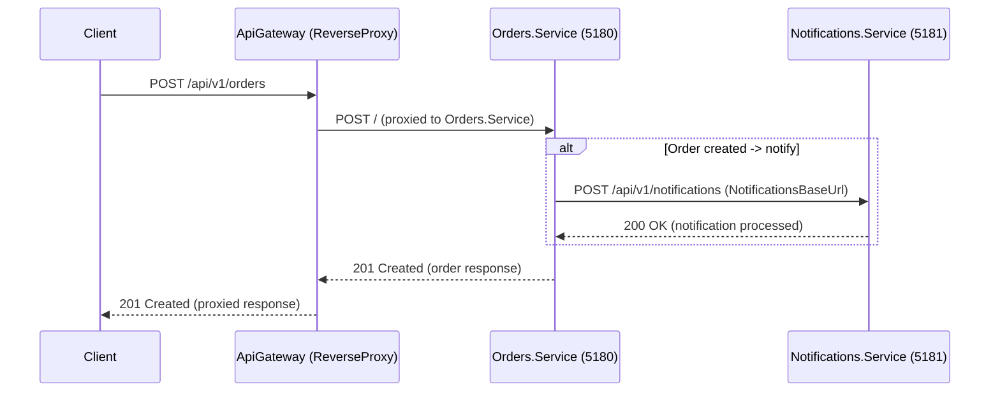
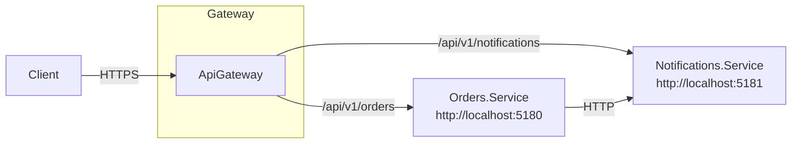

# Gateway Pattern Solution - Architecture & Flow

This document describes the projects in the solution, the request flow, and deployment / runtime notes. It includes simple diagrams (Mermaid) you can render in supporting viewers (GitHub, VS Code with Mermaid) and references to the configuration files used by the services.

## Projects
- src/ApiGateway — the API Gateway (reverse proxy) that exposes a consolidated API surface and forwards requests to downstream services. It contains ReverseProxy configuration in src/ApiGateway/appsettings.json.
- src/Orders.Service — a microservice that handles order-related operations. It may call the Notifications service for order events. Configuration in src/Orders.Service/appsettings.json.
- src/Notifications.Service — a microservice responsible for sending notifications (email, push, etc.). Configuration in src/Notifications.Service/appsettings.json.

## High-level responsibilities
- ApiGateway
  - Exposes the public endpoints /api/v1/orders and /api/v1/notifications
  - Routes incoming requests to the appropriate cluster/destination (Orders or Notifications)
  - Applies cross-cutting concerns such as caching, timeouts, idempotency, request aggregation, TLS termination, rate limiting (where implemented)
  - Configured using ReverseProxy section in appsettings.json
- Orders.Service
  - Implements business logic for creating and querying orders
  - Calls Notifications.Service when order-related notifications are required (configured via Services:NotificationsBaseUrl)
- Notifications.Service
  - Receives notification requests and processes them (delivery, persistence, etc.)

## Runtime configuration (from appsettings.json)
- ApiGateway ReverseProxy routes (src/ApiGateway/appsettings.json)
  - Path "/api/v1/orders/{**catch-all}" -> cluster "orders" -> destination http://localhost:5180/
  - Path "/api/v1/notifications/{**catch-all}" -> cluster "notifications" -> destination http://localhost:5181/
  - ActivityTimeout for each cluster: 10 seconds
  - Gateway settings include Redis connection (ConnectionStrings:Redis = localhost:6379) and idempotency/caching settings:
	- CacheAbsoluteExpirationMinutes: 2
	- IdempotencyInProgressSeconds: 60
	- IdempotencyResultHours: 24
- Orders.Service configuration (src/Orders.Service/appsettings.json)
  - Services:NotificationsBaseUrl = http://localhost:5181

Check each project's launchSettings.json or the hosting configuration to confirm ports when running with the IDE or dotnet run.

## Typical request flow (text)
1. Client sends HTTP request to ApiGateway, e.g. POST /api/v1/orders
2. ApiGateway matches the path and forwards the request to the Orders cluster (http://localhost:5180)
3. Orders.Service receives the request and performs business logic (validate, persist, etc.)
4. If a notification is required, Orders.Service calls Notifications.Service using the configured base URL (http://localhost:5181)
5. Notifications.Service processes the notification and returns a result
6. Orders.Service returns response to ApiGateway, which forwards the response to the client

## Sequence diagram (Mermaid)

## Component diagram (Mermaid)

## Notes, operational concerns and suggestions
- Timeouts: ReverseProxy sets ActivityTimeout = 10s for destinations. Tune for long-running operations.
- Idempotency & caching: ApiGateway has settings for caching and idempotency; Redis at localhost:6379 is referenced. Ensure Redis is running locally if you use those features.
- Health checks: Add readiness/health endpoints for each service and configure the gateway/host orchestrator to use them for routing and load-balancer decisions.
- Resilience: Consider retries, exponential backoff, and circuit breakers for service-to-service calls (Policies e.g., using Polly) to improve availability.
- Local ports: The appsettings document the reverse-proxy mapping to ports 5180 and 5181. Confirm each service's launch settings or Kestrel configuration before running.

## Files of interest
- src/ApiGateway/appsettings.json (reverse proxy routes & gateway settings)
- src/Orders.Service/appsettings.json (NotificationsBaseUrl)
- src/Notifications.Service/appsettings.json
- src/**/*.cs (controllers and service implementations) — inspect each project for controllers that implement exposed endpoints

- src/gatewayUI — an Angular frontend that calls the ApiGateway. The dev server proxies requests that start with /api to the gateway (see src/gatewayUI/proxy.conf.json). Run it with `npm install` and `npm start` from that folder.

## How to view this document
- Open ARCHITECTURE.md in the repository root. GitHub and many editors (VS Code) can render Mermaid diagrams if the extension/support is available.

---
Generated to describe the Gateway_Pattern solution and runtime flow. Update the document if you add more services, change routes, or modify ports.
